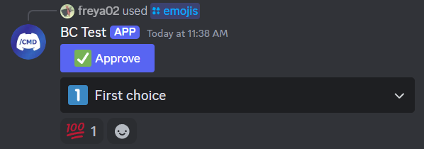

[jda-emojis-maven-central-shield]: https://img.shields.io/maven-central/v/dev.freya02/jda-emojis
[jda-emojis-maven-central-link]: https://mvnrepository.com/artifact/dev.freya02/jda-emojis/latest

## JDA Emojis
Lightweight library for [JDA](https://github.com/discord-jda/JDA), providing ready-to-use `UnicodeEmoji` objects.

## Installation
[![jda-emojis-maven-central-shield]][jda-emojis-maven-central-link]

The minimum Java version supported is Java 11.

### Kotlin Gradle
```kt
repositories {
    mavenCentral()
}

dependencies {
    implementation("dev.freya02:jda-emojis:$version") // replace $version with the latest version
}
```

### Maven
```xml
<dependency>
    <groupId>dev.freya02</groupId>
    <artifactId>jda-emojis</artifactId>
    <version>${version}</version> <!-- replace ${version} with the latest version -->
</dependency>
```

## Usage
There are two classes you can use `Emojis` and `UnicodeEmojis`, you can use either of them, they are the same.

## Examples
### Buttons
```java
Button approve = Button.primary("approve:data", "Approve").withEmoji(Emojis.WHITE_CHECK_MARK);
```

### Select menus
```java
StringSelectMenu choices = StringSelectMenu.create("choices:data")
        .addOptions(
                SelectOption.of("First choice", "1").withEmoji(Emojis.ONE)
        )
        .build();
```

### Reactions
```java
MessageCreateData messageData = new MessageCreateBuilder()
        .addActionRow(approve)
        .addActionRow(choices)
        .build();

event.reply(messageData)
        // Since we reply to a slash command, we need to retrieve the message back
        .flatMap(InteractionHook::retrieveOriginal)
        // This emoji's name is slightly different as fields can't start with digits
        .flatMap(message -> message.addReaction(Emojis.HUNDRED_POINTS))
        .queue();
```



## License
This project is licensed using the Apache 2.0 license.

## Credits
The code was generated from the emoji list provided by [discord-emojis](https://github.com/Paillat-dev/discord-emojis), which is extracted periodically from Discord.

I also use [JEmoji](https://github.com/felldo/JEmoji) to group the emojis, to reduce the number of constructed emojis at a time.
